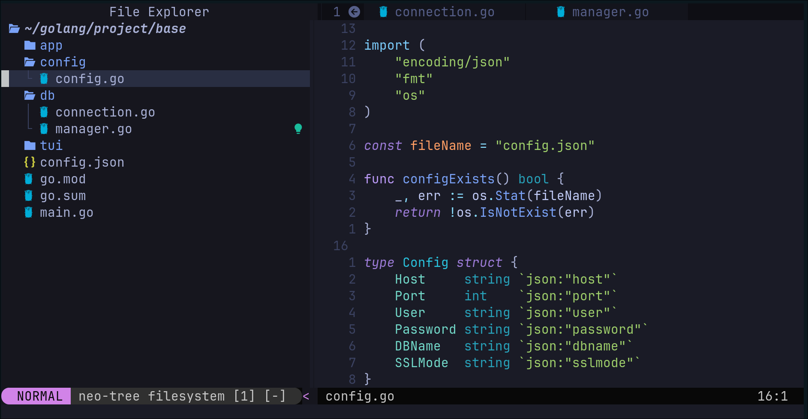
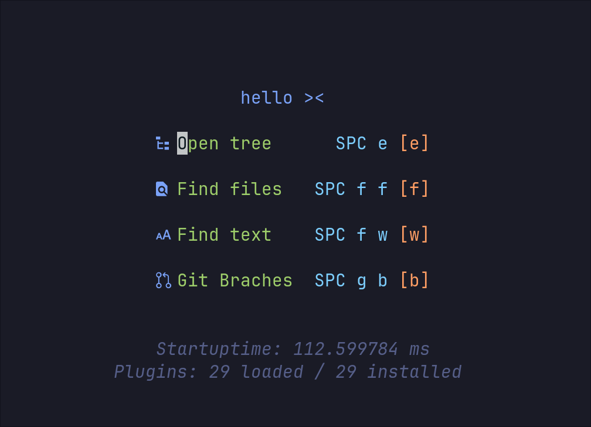

<h1 align="center">nvim-golang</h1>

<p align="center">
A minimalistic configuration nvim designed for Golang developers.
</p>

## Preview



## Features
- Golang autocomplete with gopls by default
- Catalog trees, support for TODO tags, navigation plugins, Git
- Support for diagnostics and LSP by default
- Quick search via Telescope

## Installation
```
mkdir -p ~/.config/nvim
git clone https://github.com/jvim/nvim-golang.git ~/.config/nvim
```
## Shortkeys
| ShortKey  | Action    |
|-------|-----| 
| ctrl+\ | Open\close terminal    |
| ctrl+s   | Save file    |
| ctrl+a| Copy all text |
